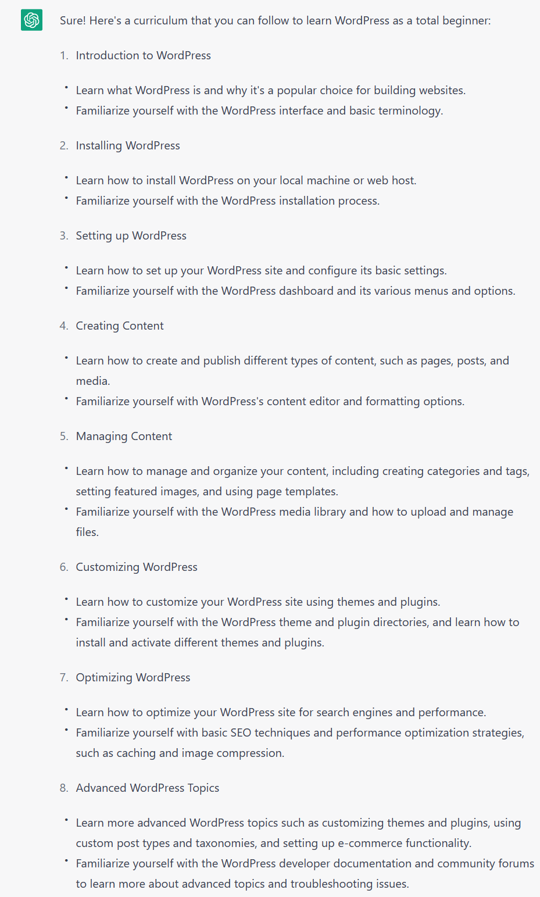

# wp-curriculum

A curriculum to learn WordPress from the very beginning

This curriculum takes a total of 10 to 12 weeks of studying time and 
consists of four (4) phases that are to be completed in succession.
Each phase, in turn, consists of one or multiple learning modules.

More details on time of study is presented alongside the learning modules,
e.g., a given module might take approximately 4 to 6 hours of study time. 

  **=> [Start with the General Introduction](introduction.md)**

## Fun: ChatGPT WordPress curriculum

I asked ChatGPT on what a WordPress curriculum should look like, and got the following answer:

This differs somewhat from what You are about to experience. Let's hope it's for the better.
