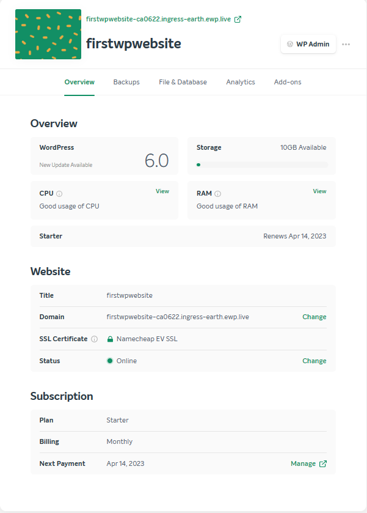

## Phase I Introduction 

**Time duration: 1 week i.e. 5 business days**

**Time off: 2 days i.e. weekend**

## TODOS

- incorporate learning of tech concepts into the Phase I curriculum 
- add ToC
- see video https://wordpress.tv/2022/11/17/wordpress-6-1-exploration/ on whether it's suitable for Phase I

## Getting introduced to WordPress

> NOTE. This section mostly deals with reading and watching videos. If you prefer to get into hands on testing of WordPress right away, go to section [Set up WordPress with free trial hosting](#set-up-wordpress-with-free-trial-hosting)

### [Astra article on learning WordPress](https://wpastra.com/resources/learning-wordpress/)

Read the article and write down answers to the following questions. Do googling as necessary, or discuss with a tech friend, or maybe [ChatGPT](https://chat.openai.com/chat).

1. Do you need to be a programmer to make us of WordPress?
2. How long does it take to learn to create new things with WordPress?
3. 
4. 
5. 

[Solutions to Astra article on learning WordPress](./solutions.md#astra-article-on-wordpress).

### [Wikipedia article on WordPress](https://en.wikipedia.org/wiki/WordPress)

Read the article and write down answers to the following questions. Do googling as necessary, or discuss with a tech friend, or maybe [ChatGPT](https://chat.openai.com/chat). 

1. What are the improvements in the latest version (6.1) of WordPress, in comparison with WordPress 6.0? Can you understand what they mean? Explain improvement X and improvement Y in your own words.
2. 
3. 
4. 
5. 

[Solutions to Wikipedia article on WordPress](./solutions.md#wikipedia-article-on-wordpress).

### [Introduction to blogging](https://wordpress.org/documentation/article/introduction-to-blogging/)

Read the article and write down answers to the following questions. Do googling as necessary, or discuss with a tech friend, or maybe [ChatGPT](https://chat.openai.com/chat). 

1. 
2. 
3. 
4. 
5. 

### [Difference between wordpress.com and wordpress.org](https://learn.wordpress.org/tutorial/what-is-the-difference-between-wordpress-org-and-com/)

Read the article and write down answers to the following questions. Do googling as necessary, or discuss with a tech friend, or maybe [ChatGPT](https://chat.openai.com/chat). 

1. 
2. 
3. 
4. 
5. 
  
## Set up WordPress with free trial hosting 

[Namecheap](https://www.namecheap.com/wordpress/) has been around for quite some time and offers a free trial of 30 days of wp hosting. 

Create a Namecheap account and choose whatever settings you like for the wp site. Below, you'll see an example wp site view in Namecheap: 

After the setup, log in to *wpadmin* by clicking the right corner in the previous view and you should now have a site that looks similar to the one below: 

> Note. While creating the Namecheap account, you need to set up a payment method. e.g. paypal or credit card. In case you cannot perform this step, utilise another free wp hosting provider.

## Register Skilljet Academy free account 

SkillJet Academy offers a free course on WordPress, the WP101. [Create a SkillJet Academy account](https://skilljet.io/login/) (it's free) and check out what they offer. 

## Complete the WP crash course: SkillJet WP101 

After registering to the SkillJet Academy, enroll into the free course "WP101". Go through the videos and during watching, take small breaks to experiment with the WordPress features on the namecheap site created in the beginning of this phase.

> Note. You are not expected to know how to apply everything that is taught after the course, this is just for starters and to show what's up

## Check out WP sites

The last part of phase I is to check out existing wp sites. You find them easily at [WordPress Showcase](https://wordpress.org/showcase/).

## Important links 

- https://learn.wordpress.org . Tutorials (as of 3/2023, most are incorporated into this curriculum)
- https://wordpress.org/documentation/ . Details of wordpress specifics, selected parts incorporated into this curriculum)
- https://wordpress.org/documentation/category/faqs/ . Frequently asked questions about Wordpress
- https://wordpress.org/support/forums/ . Discussion on wordpress related matters
- https://wordpress.tv . Videos on contemporary wordpress related matters and topics on all levels (beginner, intermediate, advanced)

## Other material

- [High level view of WordPress (lesson plan)](https://learn.wordpress.org/lesson-plan/high-level-overview/). A nice recap of essentials at this point in learning.

## Unorganized 

    ○ videos
        § https://wordpress.tv/2022/11/18/starting-fresh-on-wordpress-part-1/
        § https://wordpress.tv/2022/12/17/starting-fresh-on-wordpress-part-2/
        § https://learn.wordpress.org/tutorial/introduction-to-wordpress/
        § more videos in https://wordpress.tv/tag/beginner/
    ○ exercises on conceptual matters (leading towards applying)
• Where to find information on wordpress related matters
    ○ 
• Test wordpress
    ○ https://learn.wordpress.org/course/simple-site-design-with-full-site-editing/ and select "Practise on a private demo site"
    ○ site and template editor video  https://learn.wordpress.org/tutorial/intro-to-the-site-editor-and-template-editor/
    ○ TODO add more practical doing here
        § TODO practice and define exercise
            □ explore different views (tablet, mobile)
            □ edit block
            □ add block
            □ remove block

