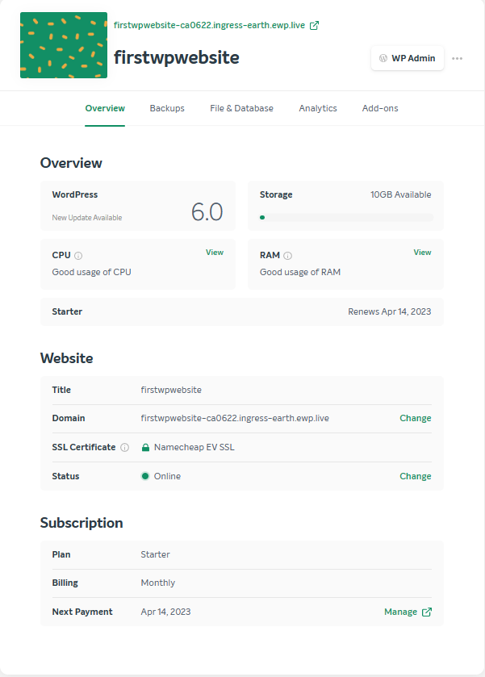
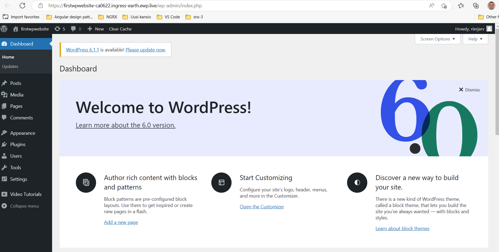

## Phase I Introduction 

> Time duration: 1 week i.e. 5 business days
> Time off: 2 days i.e. weekend

**TODO TOC**

**TODO: structure the module as such that practical doing and theory are interrelated**

## Getting introduced to WordPress

> NOTE. This section contains reading and watching videos. If you prefer to get hands on right away, go to section [Set up WordPress with free trial hosting](#set-up-wordpress-with-free-trial-hosting)

What is WordPress? Start by exploring the following content.  

- https://kinsta.com/knowledgebase/what-is-wordpress/
  
## Set up WordPress with free trial hosting 

The service (https://www.namecheap.com/wordpress/)[Namecheap] has been around for quite some time and offers a free trial of 30 days wp hosting. 

Create a namecheap account and choose whatever settings for the wp site. Below, you'll see an example wp site view in namecheap: 

After the setup, log in to *wpadmin* by clicking the right corner in the previous view and you should now have a site that looks similar to the one below: 

> Note. While creating the Namecheap account, you need to set up a payment method. e.g. paypal or credit card. In case you cannot perform this step, utilise another free wp hosting provider.

## Register Skilljet Academy free account 

## WP crash course: SkillJet WP101 

After registering to the SkillJet Academy, enroll into the free course "WP101". Go through the videos and during watching, take small breaks to experiment with the WordPress features on the namecheap site created in the beginning of this phase.

## Unorganized 

Phase I: Get to know Wordpress 
Content

• motivation (how long does it take to learn wp, and what is included
    ○ 
    ○ read blogging intro:  https://wordpress.org/documentation/article/introduction-to-blogging/
        § TODO quiz + solutions
    ○ read  https://wpastra.com/resources/learning-wordpress/
        § As of Jan 2023, WordPress powers nearly 40% of all websites on the internet. It’s also risen 5% since this time last year.
        § no need to be programmer to use workdpress
        § if you do programming, you can develop WP things of your own
            □ Q: what can you develop with WP?
        § 3 to 6 months of study to be able to create things (incl. programming) in a proficient manner
        § TODO quiz on the site, questions and answers read article again
    ○ read  https://learn.wordpress.org/lesson-plan/high-level-overview/
        § TODO quiz on the site, questions and answers read article again
    ○ lesson  https://learn.wordpress.org/lesson-plan/general-history-of-wordpress/
        § TODO specifics
    ○ .com vs .org wordpress
        § https://learn.wordpress.org/tutorial/what-is-the-difference-between-wordpress-org-and-com/
    ○ video on WP 6.1
        § https://wordpress.tv/2022/11/17/wordpress-6-1-exploration/
    ○ Google a site of your choice, which discusses learning wordpress
    ○ wp sites  https://wordpress.org/showcase/
        § TODO quiz / what to do
        § come up with at least three (3) questions that come up during reading the site, and try to find their answers by googling. these can be e.g. for you new technical terms
• Create an account to skilljet - use the beginner course as a "crash course" 1 to 2 days
    ○ TODO note actual time of watching videos + prepare a list of active things to do while watching videos (at least try out all things described in the video). Mention that we'll get back to these later, this is just for taking a crash course and not expected to know how to apply everything after the course (just to show what's up) 
• Instructinal video on getting a simple free wp site up and running (brief testing of features concurrently with the theory part of phase I)
• important links
    ○ https://learn.wordpress.org
        § tutorials (as of 3/2023, most are incorporated into this curriculum)
    ○ https://wordpress.org/documentation/
        § details of wordpress specifics, selected parts incorporated into this curriculum)
    ○ https://wordpress.org/documentation/category/faqs/
    ○ https://wordpress.org/support/forums/
        § discussion on wordpress related matters
    ○ https://wordpress.tv
        § videos on contemporary wordpress related matters and topics on all levels (beginner, intermediate, advanced)
• general theory e.g. web hosting, web hotel, cloud hosting
    ○ overview of hosting
        § TODO articles
        § discuss questions
            □ what does hosting mean?
            □ why paid hosting?
            □ TODO more questions
    ○ videos
        § https://wordpress.tv/2022/11/18/starting-fresh-on-wordpress-part-1/
        § https://wordpress.tv/2022/12/17/starting-fresh-on-wordpress-part-2/
        § https://learn.wordpress.org/tutorial/introduction-to-wordpress/
        § more videos in  https://wordpress.tv/tag/beginner/
        § TODO incl questions + answers
    ○ readings (wpbeginner articles)
        § TODO
        § TODO
        § TODO incl questions + answers
    ○ example wordpress sites (navigation)
        § TODO
        § TODO
        § TODO incl questions + answers
    ○ take a look at free vs paid plugins (video, and site examples)
        § TODO
        § TODO
        § TODO incl questions + answers
    ○ exercises on conceptual matters (leading towards applying)
• Where to find information on wordpress related matters
    ○ https://www.smashingmagazine.com/ front end development
• Test wordpress
    ○ see how the new gutenberg editing looks like (cannot edit much though)  https://wordpress.org/gutenberg/
    ○ https://learn.wordpress.org/course/simple-site-design-with-full-site-editing/ and select "Practise on a private demo site"
    ○ site and template editor video  https://learn.wordpress.org/tutorial/intro-to-the-site-editor-and-template-editor/
    ○ TODO add more practical doing here
        § TODO practice and define exercise
            □ explore different views (tablet, mobile)
            □ edit block
            □ add block
            □ remove block
        § TODO can this course be taken as-is?
            □ how to enroll / is this free?
